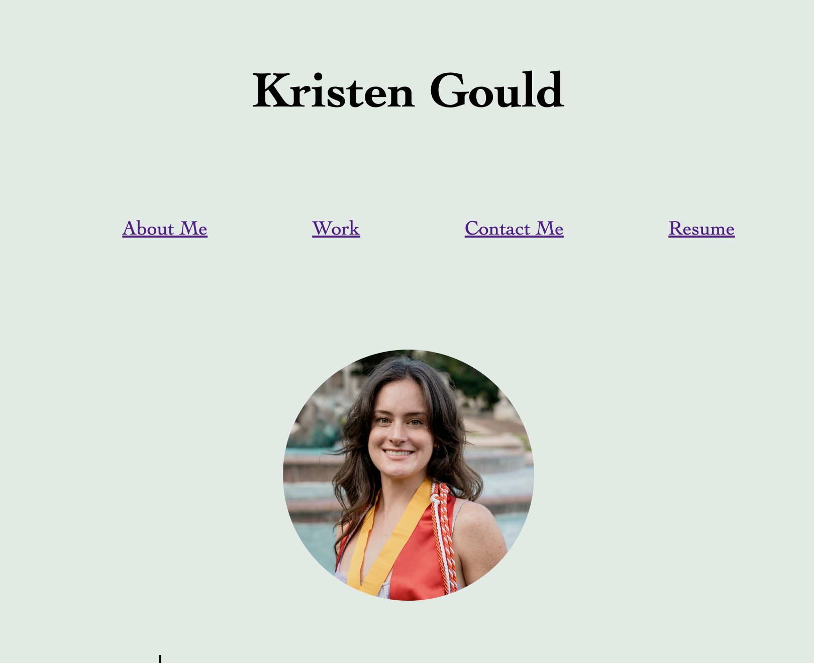

# Professional Portfolio

## Description 

This project is a professional portfolio page. The purpose of this portfolio is to provide a platform to showcase information about myself and my work for future employers to view. Through the process of creating this project I learned about the HTML framework, advanced CSS, and GitHub deployment. 

## Usage

Click the links in the header to jump to the section you would like to read about! You can also click directly on the links in the contact section to send me an email and access my GitHub and LinkedIn.